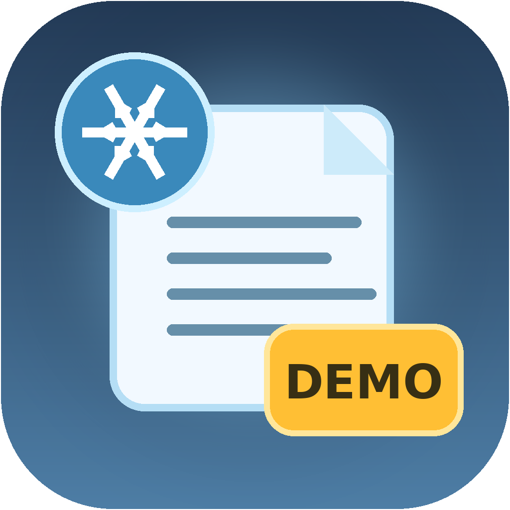

<div align="center">

<p align="center">
  
</p>

# Snowblik Article Generator Demo

**Бесплатная Windows-программа для знакомства с генерацией статей через локальный ИИ, OpenAI и Google Gemini**


[Скачать Demo](../../releases/latest) · [Сообщить об ошибке](../../issues)

</div>

---

## О программе

**Snowblik Article Generator Demo** — бесплатная ознакомительная версия генератора статей от Snowblik Studio. Она позволяет проверить интерфейс, создать статью, отредактировать результат и оценить работу разных ИИ-провайдеров.

Для знакомства без регистрации и API-ключей предусмотрен встроенный режим **Demo**. Для полноценной генерации можно подключить локальную Ollama либо собственные ключи OpenAI и Google Gemini.

## Возможности Demo 1.0.0

- создание новой статьи по теме и ключевым словам;
- встроенный тестовый Demo-провайдер без API-ключа;
- локальная бесплатная генерация через Ollama;
- поддержка OpenAI и Google Gemini;
- настройка темы, типа материала, языка, стиля и аудитории;
- объём статьи до **700 слов**;
- редактирование готового результата;
- сохранение статьи в доступные форматы;
- отдельная папка пользовательских данных;
- до **5 успешных генераций** через Ollama, OpenAI или Gemini.

> Ошибочные или остановленные запросы не должны расходовать лимит успешных генераций.

## Demo и полная версия

| Возможность | Demo | Полная версия |
|---|:---:|:---:|
| Новая статья | ✅ | ✅ |
| Встроенный Demo-провайдер | ✅ | ✅ |
| Ollama, OpenAI и Gemini | ✅ | ✅ |
| Статья по готовому плану | — | ✅ |
| Переработка и улучшение текста | — | ✅ |
| Проекты и история | — | ✅ |
| Content Formatter | — | ✅ |
| Media Manager | — | ✅ |
| Image Generator | — | ✅ |
| SEO Quality Checker | — | ✅ |
| Internal Linking Assistant | — | ✅ |
| WordPress, Telegram и VK | — | ✅ |
| Content Scheduler | — | ✅ |
| Массовый Content Pipeline | — | ✅ |

## Установка

1. Откройте раздел **[Releases](../../releases/latest)**.
2. Скачайте файл `Snowblik-Article-Generator-Demo-1.0.0-Windows.zip`.
3. Распакуйте архив в отдельную папку.
4. Запустите `Snowblik-Article-Generator-Demo.exe`.

> Не запускайте EXE прямо из ZIP-архива — сначала обязательно распакуйте все файлы.

### Предупреждение Windows SmartScreen

При первом запуске Windows может показать предупреждение для нового приложения без коммерческой цифровой подписи. Нажмите:

**Подробнее → Выполнить в любом случае**

Скачивайте программу только из раздела Releases этого репозитория и при необходимости сверяйте SHA-256.

## Быстрый старт

1. В поле **Режим** выберите `Demo`.
2. Откройте вкладку **Article Generator**.
3. Укажите тему статьи.
4. При необходимости заполните ключевые слова и другие параметры.
5. Нажмите **Создать статью**.
6. Отредактируйте результат и сохраните его.

Для локальной генерации выберите **Ollama**, установите приложение Ollama и загрузите предложенную модель через интерфейс программы.

## Системные требования

- Windows 10 или Windows 11, 64-bit;
- не менее 4 ГБ оперативной памяти для облачной генерации;
- больше оперативной памяти для локальных моделей Ollama;
- интернет для OpenAI, Gemini и загрузки моделей Ollama;
- свободное место на диске для программы и локальной модели.

## Где сохраняются файлы

Рядом с программой автоматически создаётся папка:

```text
Snowblik Article Generator Demo Data
```

В ней находятся готовые статьи, журналы и другие пользовательские данные Demo-версии.

## Конфиденциальность

- программа не содержит встроенных API-ключей;
- пользователь вводит собственные ключи OpenAI или Gemini;
- для локальной генерации через Ollama API-ключ не требуется;
- тексты при работе через Ollama обрабатываются на компьютере пользователя;
- при использовании облачного провайдера запрос отправляется выбранному сервису.

## Проверка SHA-256

В релизе рядом с ZIP-архивом опубликован файл контрольной суммы.

Проверка через PowerShell:

```powershell
Get-FileHash .\Snowblik-Article-Generator-Demo-1.0.0-Windows.zip -Algorithm SHA256
```

Полученное значение должно совпадать со значением в файле `Snowblik-Article-Generator-Demo-1.0.0-Windows-SHA256.txt`.

## Документация

Подробная инструкция в PDF находится внутри архива программы в папке `Documentation` и отдельно прикреплена к релизу.

## Обратная связь

Нашли ошибку или хотите предложить улучшение — создайте обращение в разделе **[Issues](../../issues)**.

---

<div align="center">

**Snowblik Studio**  
Snowblik Article Generator Demo © 2026

</div>
